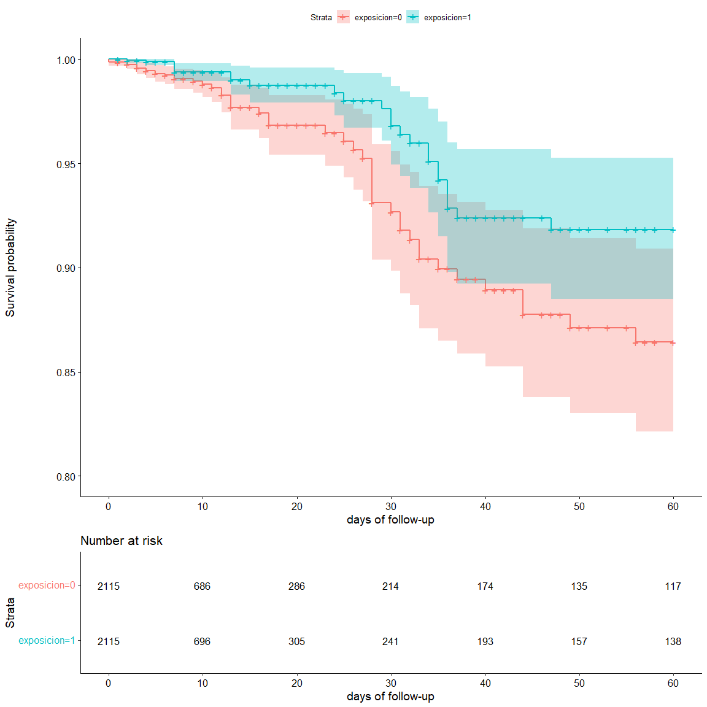

```r
# función para cargar un .Rmd como si se hiciese source de un .r---------------
source_rmd = function(file, ...) {
  tmp_file = tempfile(fileext = ".R")
  on.exit(unlink(tmp_file), add = TRUE)
  knitr::purl(file, output = tmp_file)
  source(file = tmp_file, ...)
}
```


```r
# cargar funciones de 0_funciones----------------------------------------------
if (!exists("se_ha_cargado_f")) {
source_rmd("0_b_funciones.rmd")
}
```

```
## 
## 
## processing file: 0_b_funciones.rmd
```

```
## 
  |                                                                            
  |                                                                      |   0%
  |                                                                            
  |....                                                                  |   6%
  |                                                                            
  |........                                                              |  11%
  |                                                                            
  |............                                                          |  17%
  |                                                                            
  |................                                                      |  22%
  |                                                                            
  |...................                                                   |  28%
  |                                                                            
  |.......................                                               |  33%
  |                                                                            
  |...........................                                           |  39%
  |                                                                            
  |...............................                                       |  44%
  |                                                                            
  |...................................                                   |  50%
  |                                                                            
  |.......................................                               |  56%
  |                                                                            
  |...........................................                           |  61%
  |                                                                            
  |...............................................                       |  67%
  |                                                                            
  |...................................................                   |  72%
  |                                                                            
  |......................................................                |  78%
  |                                                                            
  |..........................................................            |  83%
  |                                                                            
  |..............................................................        |  89%
  |                                                                            
  |..................................................................    |  94%
  |                                                                            
  |......................................................................| 100%
```

```
## output file: C:\Users\fcosa\AppData\Local\Temp\Rtmp8c6Hzc\fileb285006532c.R
```

```
## 
## Attaching package: 'lubridate'
```

```
## The following objects are masked from 'package:data.table':
## 
##     hour, isoweek, mday, minute, month, quarter, second, wday, week,
##     yday, year
```

```
## The following objects are masked from 'package:base':
## 
##     date, intersect, setdiff, union
```

```
## ── Attaching packages ─────────────────────────────────────── tidyverse 1.3.1 ──
```

```
## ✔ ggplot2 3.3.6     ✔ dplyr   1.0.9
## ✔ tibble  3.1.7     ✔ stringr 1.4.0
## ✔ tidyr   1.2.0     ✔ forcats 0.5.1
## ✔ purrr   0.3.4
```

```
## ── Conflicts ────────────────────────────────────────── tidyverse_conflicts() ──
## ✖ lubridate::as.difftime() masks base::as.difftime()
## ✖ dplyr::between()         masks data.table::between()
## ✖ lubridate::date()        masks base::date()
## ✖ dplyr::filter()          masks stats::filter()
## ✖ dplyr::first()           masks data.table::first()
## ✖ lubridate::hour()        masks data.table::hour()
## ✖ lubridate::intersect()   masks base::intersect()
## ✖ lubridate::isoweek()     masks data.table::isoweek()
## ✖ dplyr::lag()             masks stats::lag()
## ✖ dplyr::last()            masks data.table::last()
## ✖ lubridate::mday()        masks data.table::mday()
## ✖ lubridate::minute()      masks data.table::minute()
## ✖ lubridate::month()       masks data.table::month()
## ✖ lubridate::quarter()     masks data.table::quarter()
## ✖ lubridate::second()      masks data.table::second()
## ✖ lubridate::setdiff()     masks base::setdiff()
## ✖ purrr::transpose()       masks data.table::transpose()
## ✖ lubridate::union()       masks base::union()
## ✖ lubridate::wday()        masks data.table::wday()
## ✖ lubridate::week()        masks data.table::week()
## ✖ lubridate::yday()        masks data.table::yday()
## ✖ lubridate::year()        masks data.table::year()
```

```
## 
## Attaching package: 'kableExtra'
```

```
## The following object is masked from 'package:dplyr':
## 
##     group_rows
```

```
## ------------------------------------------------------------------------------
```

```
## You have loaded plyr after dplyr - this is likely to cause problems.
## If you need functions from both plyr and dplyr, please load plyr first, then dplyr:
## library(plyr); library(dplyr)
```

```
## ------------------------------------------------------------------------------
```

```
## 
## Attaching package: 'plyr'
```

```
## The following objects are masked from 'package:dplyr':
## 
##     arrange, count, desc, failwith, id, mutate, rename, summarise,
##     summarize
```

```
## The following object is masked from 'package:purrr':
## 
##     compact
```

```
## 
## Attaching package: 'ggpubr'
```

```
## The following object is masked from 'package:plyr':
## 
##     mutate
```

```
## 
## Attaching package: 'scales'
```

```
## The following object is masked from 'package:purrr':
## 
##     discard
```

```
## The following object is masked from 'package:readr':
## 
##     col_factor
```

```
## Warning: package 'plotly' was built under R version 4.2.1
```

```
## 
## Attaching package: 'plotly'
```

```
## The following objects are masked from 'package:plyr':
## 
##     arrange, mutate, rename, summarise
```

```
## The following object is masked from 'package:ggplot2':
## 
##     last_plot
```

```
## The following object is masked from 'package:stats':
## 
##     filter
```

```
## The following object is masked from 'package:graphics':
## 
##     layout
```

```
## Warning: package 'Matching' was built under R version 4.2.1
```

```
## Loading required package: MASS
```

```
## 
## Attaching package: 'MASS'
```

```
## The following object is masked from 'package:plotly':
## 
##     select
```

```
## The following object is masked from 'package:dplyr':
## 
##     select
```

```
## ## 
## ##  Matching (Version 4.10-2, Build Date: 2022-04-13)
## ##  See http://sekhon.berkeley.edu/matching for additional documentation.
## ##  Please cite software as:
## ##   Jasjeet S. Sekhon. 2011. ``Multivariate and Propensity Score Matching
## ##   Software with Automated Balance Optimization: The Matching package for R.''
## ##   Journal of Statistical Software, 42(7): 1-52. 
## ##
```

```
## 
## Attaching package: 'plotrix'
```

```
## The following object is masked from 'package:scales':
## 
##     rescale
```

```
## Warning: package 'ggpmisc' was built under R version 4.2.1
```

```
## Loading required package: ggpp
```

```
## Warning: package 'ggpp' was built under R version 4.2.1
```

```
## 
## Attaching package: 'ggpp'
```

```
## The following object is masked from 'package:ggplot2':
## 
##     annotate
```

```
## 
## Attaching package: 'survival'
```

```
## The following object is masked from 'package:survminer':
## 
##     myeloma
```

```
## Warning: package 'conflicted' was built under R version 4.2.1
```

```
## Warning: package 'gluedown' was built under R version 4.2.1
```

```
## [conflicted] Will prefer dplyr::across over any other package
```

```
## [conflicted] Will prefer dplyr::add_count over any other package
## [conflicted] Will prefer dplyr::add_count_ over any other package
## [conflicted] Will prefer dplyr::add_rownames over any other package
## [conflicted] Will prefer dplyr::add_tally over any other package
## [conflicted] Will prefer dplyr::add_tally_ over any other package
## [conflicted] Will prefer dplyr::all_equal over any other package
## [conflicted] Will prefer dplyr::all_vars over any other package
## [conflicted] Will prefer dplyr::anti_join over any other package
## [conflicted] Will prefer dplyr::any_vars over any other package
## [conflicted] Will prefer dplyr::arrange over any other package
## [conflicted] Will prefer dplyr::arrange_ over any other package
## [conflicted] Will prefer dplyr::arrange_all over any other package
## [conflicted] Will prefer dplyr::arrange_at over any other package
## [conflicted] Will prefer dplyr::arrange_if over any other package
## [conflicted] Will prefer dplyr::as.tbl over any other package
## [conflicted] Will prefer dplyr::auto_copy over any other package
## [conflicted] Will prefer dplyr::band_instruments over any other package
## [conflicted] Will prefer dplyr::band_instruments2 over any other package
## [conflicted] Will prefer dplyr::band_members over any other package
## [conflicted] Will prefer dplyr::bench_tbls over any other package
## [conflicted] Will prefer dplyr::between over any other package
## [conflicted] Will prefer dplyr::bind_cols over any other package
## [conflicted] Will prefer dplyr::bind_rows over any other package
## [conflicted] Will prefer dplyr::c_across over any other package
## [conflicted] Will prefer dplyr::case_when over any other package
## [conflicted] Will prefer dplyr::changes over any other package
## [conflicted] Will prefer dplyr::check_dbplyr over any other package
## [conflicted] Will prefer dplyr::coalesce over any other package
## [conflicted] Will prefer dplyr::collapse over any other package
## [conflicted] Will prefer dplyr::collect over any other package
## [conflicted] Will prefer dplyr::combine over any other package
## [conflicted] Will prefer dplyr::common_by over any other package
## [conflicted] Will prefer dplyr::compare_tbls over any other package
## [conflicted] Will prefer dplyr::compare_tbls2 over any other package
## [conflicted] Will prefer dplyr::compute over any other package
## [conflicted] Will prefer dplyr::copy_to over any other package
## [conflicted] Will prefer dplyr::count over any other package
## [conflicted] Will prefer dplyr::count_ over any other package
## [conflicted] Will prefer dplyr::cumall over any other package
## [conflicted] Will prefer dplyr::cumany over any other package
## [conflicted] Will prefer dplyr::cume_dist over any other package
## [conflicted] Will prefer dplyr::cummean over any other package
## [conflicted] Will prefer dplyr::cur_column over any other package
## [conflicted] Will prefer dplyr::cur_data over any other package
## [conflicted] Will prefer dplyr::cur_data_all over any other package
## [conflicted] Will prefer dplyr::cur_group over any other package
## [conflicted] Will prefer dplyr::cur_group_id over any other package
## [conflicted] Will prefer dplyr::cur_group_rows over any other package
## [conflicted] Will prefer dplyr::current_vars over any other package
## [conflicted] Will prefer dplyr::db_analyze over any other package
## [conflicted] Will prefer dplyr::db_begin over any other package
## [conflicted] Will prefer dplyr::db_commit over any other package
## [conflicted] Will prefer dplyr::db_create_index over any other package
## [conflicted] Will prefer dplyr::db_create_indexes over any other package
## [conflicted] Will prefer dplyr::db_create_table over any other package
## [conflicted] Will prefer dplyr::db_data_type over any other package
## [conflicted] Will prefer dplyr::db_desc over any other package
## [conflicted] Will prefer dplyr::db_drop_table over any other package
## [conflicted] Will prefer dplyr::db_explain over any other package
## [conflicted] Will prefer dplyr::db_has_table over any other package
## [conflicted] Will prefer dplyr::db_insert_into over any other package
## [conflicted] Will prefer dplyr::db_list_tables over any other package
## [conflicted] Will prefer dplyr::db_query_fields over any other package
## [conflicted] Will prefer dplyr::db_query_rows over any other package
## [conflicted] Will prefer dplyr::db_rollback over any other package
## [conflicted] Will prefer dplyr::db_save_query over any other package
## [conflicted] Will prefer dplyr::db_write_table over any other package
## [conflicted] Will prefer dplyr::dense_rank over any other package
## [conflicted] Will prefer dplyr::desc over any other package
## [conflicted] Will prefer dplyr::dim_desc over any other package
## [conflicted] Will prefer dplyr::distinct over any other package
## [conflicted] Will prefer dplyr::distinct_ over any other package
## [conflicted] Will prefer dplyr::distinct_all over any other package
## [conflicted] Will prefer dplyr::distinct_at over any other package
## [conflicted] Will prefer dplyr::distinct_if over any other package
## [conflicted] Will prefer dplyr::distinct_prepare over any other package
## [conflicted] Will prefer dplyr::do over any other package
## [conflicted] Will prefer dplyr::do_ over any other package
## [conflicted] Will prefer dplyr::dplyr_col_modify over any other package
## [conflicted] Will prefer dplyr::dplyr_reconstruct over any other package
## [conflicted] Will prefer dplyr::dplyr_row_slice over any other package
## [conflicted] Will prefer dplyr::eval_tbls over any other package
## [conflicted] Will prefer dplyr::eval_tbls2 over any other package
## [conflicted] Will prefer dplyr::explain over any other package
## [conflicted] Will prefer dplyr::failwith over any other package
## [conflicted] Will prefer dplyr::filter over any other package
## [conflicted] Will prefer dplyr::filter_ over any other package
## [conflicted] Will prefer dplyr::filter_all over any other package
## [conflicted] Will prefer dplyr::filter_at over any other package
## [conflicted] Will prefer dplyr::filter_if over any other package
## [conflicted] Will prefer dplyr::first over any other package
## [conflicted] Will prefer dplyr::full_join over any other package
## [conflicted] Will prefer dplyr::funs over any other package
## [conflicted] Will prefer dplyr::funs_ over any other package
## [conflicted] Will prefer dplyr::group_by over any other package
## [conflicted] Will prefer dplyr::group_by_ over any other package
## [conflicted] Will prefer dplyr::group_by_all over any other package
## [conflicted] Will prefer dplyr::group_by_at over any other package
## [conflicted] Will prefer dplyr::group_by_drop_default over any other package
## [conflicted] Will prefer dplyr::group_by_if over any other package
## [conflicted] Will prefer dplyr::group_by_prepare over any other package
## [conflicted] Will prefer dplyr::group_cols over any other package
## [conflicted] Will prefer dplyr::group_data over any other package
## [conflicted] Will prefer dplyr::group_indices over any other package
## [conflicted] Will prefer dplyr::group_indices_ over any other package
## [conflicted] Will prefer dplyr::group_keys over any other package
## [conflicted] Will prefer dplyr::group_map over any other package
## [conflicted] Will prefer dplyr::group_modify over any other package
## [conflicted] Will prefer dplyr::group_nest over any other package
## [conflicted] Will prefer dplyr::group_rows over any other package
## [conflicted] Will prefer dplyr::group_size over any other package
## [conflicted] Will prefer dplyr::group_split over any other package
## [conflicted] Will prefer dplyr::group_trim over any other package
## [conflicted] Will prefer dplyr::group_vars over any other package
## [conflicted] Will prefer dplyr::group_walk over any other package
## [conflicted] Will prefer dplyr::grouped_df over any other package
## [conflicted] Will prefer dplyr::groups over any other package
## [conflicted] Will prefer dplyr::id over any other package
## [conflicted] Will prefer dplyr::ident over any other package
## [conflicted] Will prefer dplyr::if_all over any other package
## [conflicted] Will prefer dplyr::if_any over any other package
## [conflicted] Will prefer dplyr::if_else over any other package
## [conflicted] Will prefer dplyr::inner_join over any other package
## [conflicted] Will prefer dplyr::is.grouped_df over any other package
## [conflicted] Will prefer dplyr::is.src over any other package
## [conflicted] Will prefer dplyr::is.tbl over any other package
## [conflicted] Will prefer dplyr::is_grouped_df over any other package
## [conflicted] Will prefer dplyr::lag over any other package
## [conflicted] Will prefer dplyr::last over any other package
## [conflicted] Will prefer dplyr::lead over any other package
## [conflicted] Will prefer dplyr::left_join over any other package
## [conflicted] Will prefer dplyr::location over any other package
## [conflicted] Will prefer dplyr::make_tbl over any other package
## [conflicted] Will prefer dplyr::min_rank over any other package
## [conflicted] Will prefer dplyr::mutate over any other package
## [conflicted] Will prefer dplyr::mutate_ over any other package
## [conflicted] Will prefer dplyr::mutate_all over any other package
## [conflicted] Will prefer dplyr::mutate_at over any other package
## [conflicted] Will prefer dplyr::mutate_each over any other package
## [conflicted] Will prefer dplyr::mutate_each_ over any other package
## [conflicted] Will prefer dplyr::mutate_if over any other package
## [conflicted] Will prefer dplyr::n over any other package
## [conflicted] Will prefer dplyr::n_distinct over any other package
## [conflicted] Will prefer dplyr::n_groups over any other package
## [conflicted] Will prefer dplyr::na_if over any other package
## [conflicted] Will prefer dplyr::near over any other package
## [conflicted] Will prefer dplyr::nest_by over any other package
## [conflicted] Will prefer dplyr::nest_join over any other package
## [conflicted] Will prefer dplyr::new_grouped_df over any other package
## [conflicted] Will prefer dplyr::new_rowwise_df over any other package
## [conflicted] Will prefer dplyr::nth over any other package
## [conflicted] Will prefer dplyr::ntile over any other package
## [conflicted] Will prefer dplyr::order_by over any other package
## [conflicted] Will prefer dplyr::percent_rank over any other package
## [conflicted] Will prefer dplyr::progress_estimated over any other package
## [conflicted] Will prefer dplyr::pull over any other package
## [conflicted] Will prefer dplyr::recode over any other package
## [conflicted] Will prefer dplyr::recode_factor over any other package
## [conflicted] Will prefer dplyr::relocate over any other package
## [conflicted] Will prefer dplyr::rename over any other package
## [conflicted] Will prefer dplyr::rename_ over any other package
## [conflicted] Will prefer dplyr::rename_all over any other package
## [conflicted] Will prefer dplyr::rename_at over any other package
## [conflicted] Will prefer dplyr::rename_if over any other package
## [conflicted] Will prefer dplyr::rename_vars over any other package
## [conflicted] Will prefer dplyr::rename_vars_ over any other package
## [conflicted] Will prefer dplyr::rename_with over any other package
## [conflicted] Will prefer dplyr::right_join over any other package
## [conflicted] Will prefer dplyr::row_number over any other package
## [conflicted] Will prefer dplyr::rows_append over any other package
## [conflicted] Will prefer dplyr::rows_delete over any other package
## [conflicted] Will prefer dplyr::rows_insert over any other package
## [conflicted] Will prefer dplyr::rows_patch over any other package
## [conflicted] Will prefer dplyr::rows_update over any other package
## [conflicted] Will prefer dplyr::rows_upsert over any other package
## [conflicted] Will prefer dplyr::rowwise over any other package
## [conflicted] Will prefer dplyr::same_src over any other package
## [conflicted] Will prefer dplyr::sample_frac over any other package
## [conflicted] Will prefer dplyr::sample_n over any other package
## [conflicted] Will prefer dplyr::select over any other package
## [conflicted] Will prefer dplyr::select_ over any other package
## [conflicted] Will prefer dplyr::select_all over any other package
## [conflicted] Will prefer dplyr::select_at over any other package
## [conflicted] Will prefer dplyr::select_if over any other package
## [conflicted] Will prefer dplyr::select_var over any other package
## [conflicted] Will prefer dplyr::select_vars over any other package
## [conflicted] Will prefer dplyr::select_vars_ over any other package
## [conflicted] Will prefer dplyr::semi_join over any other package
## [conflicted] Will prefer dplyr::show_query over any other package
## [conflicted] Will prefer dplyr::slice over any other package
## [conflicted] Will prefer dplyr::slice_ over any other package
## [conflicted] Will prefer dplyr::slice_head over any other package
## [conflicted] Will prefer dplyr::slice_max over any other package
## [conflicted] Will prefer dplyr::slice_min over any other package
## [conflicted] Will prefer dplyr::slice_sample over any other package
## [conflicted] Will prefer dplyr::slice_tail over any other package
## [conflicted] Will prefer dplyr::sql over any other package
## [conflicted] Will prefer dplyr::sql_escape_ident over any other package
## [conflicted] Will prefer dplyr::sql_escape_string over any other package
## [conflicted] Will prefer dplyr::sql_join over any other package
## [conflicted] Will prefer dplyr::sql_select over any other package
## [conflicted] Will prefer dplyr::sql_semi_join over any other package
## [conflicted] Will prefer dplyr::sql_set_op over any other package
## [conflicted] Will prefer dplyr::sql_subquery over any other package
## [conflicted] Will prefer dplyr::sql_translate_env over any other package
## [conflicted] Will prefer dplyr::src over any other package
## [conflicted] Will prefer dplyr::src_df over any other package
## [conflicted] Will prefer dplyr::src_local over any other package
## [conflicted] Will prefer dplyr::src_mysql over any other package
## [conflicted] Will prefer dplyr::src_postgres over any other package
## [conflicted] Will prefer dplyr::src_sqlite over any other package
## [conflicted] Will prefer dplyr::src_tbls over any other package
## [conflicted] Will prefer dplyr::starwars over any other package
## [conflicted] Will prefer dplyr::storms over any other package
## [conflicted] Will prefer dplyr::summarise over any other package
## [conflicted] Will prefer dplyr::summarise_ over any other package
## [conflicted] Will prefer dplyr::summarise_all over any other package
## [conflicted] Will prefer dplyr::summarise_at over any other package
## [conflicted] Will prefer dplyr::summarise_each over any other package
## [conflicted] Will prefer dplyr::summarise_each_ over any other package
## [conflicted] Will prefer dplyr::summarise_if over any other package
## [conflicted] Will prefer dplyr::summarize over any other package
## [conflicted] Will prefer dplyr::summarize_ over any other package
## [conflicted] Will prefer dplyr::summarize_all over any other package
## [conflicted] Will prefer dplyr::summarize_at over any other package
## [conflicted] Will prefer dplyr::summarize_each over any other package
## [conflicted] Will prefer dplyr::summarize_each_ over any other package
## [conflicted] Will prefer dplyr::summarize_if over any other package
## [conflicted] Will prefer dplyr::tally over any other package
## [conflicted] Will prefer dplyr::tally_ over any other package
## [conflicted] Will prefer dplyr::tbl over any other package
## [conflicted] Will prefer dplyr::tbl_df over any other package
## [conflicted] Will prefer dplyr::tbl_nongroup_vars over any other package
## [conflicted] Will prefer dplyr::tbl_ptype over any other package
## [conflicted] Will prefer dplyr::tbl_vars over any other package
## [conflicted] Will prefer dplyr::top_frac over any other package
## [conflicted] Will prefer dplyr::top_n over any other package
## [conflicted] Will prefer dplyr::transmute over any other package
## [conflicted] Will prefer dplyr::transmute_ over any other package
## [conflicted] Will prefer dplyr::transmute_all over any other package
## [conflicted] Will prefer dplyr::transmute_at over any other package
## [conflicted] Will prefer dplyr::transmute_if over any other package
## [conflicted] Will prefer dplyr::ungroup over any other package
## [conflicted] Will prefer dplyr::union_all over any other package
## [conflicted] Will prefer dplyr::validate_grouped_df over any other package
## [conflicted] Will prefer dplyr::validate_rowwise_df over any other package
## [conflicted] Will prefer dplyr::vars over any other package
## [conflicted] Will prefer dplyr::with_groups over any other package
## [conflicted] Will prefer dplyr::with_order over any other package
## [conflicted] Will prefer dplyr::wrap_dbplyr_obj over any other package
```


```r
# se crean listas que dependen del proyecto------------------------------------
lista_exclusion_dep <- list(
  criterios = list(
  c1 = "Excluyendo: infección previa antes del tiempo_0...",
  c2 = "Excluyendo: edad < 40 años en tiempo_0...", 
  c3 = "Excluyendo: pauta incompleta 90 días antes del tiempo_0...",
  c4 = "Excluyendo: fallecidos antes del tiempo_0...",
  c5 = "Excluyendo: boosting antes del tiempo_0..."),
  variables = list(
  v1 = "fcv1",
  v2 = "fnac_40",
  v3 = "fpauta_90",
  v4 = "fdef",
  v5 = "fvc3"),
  tipo_var = list(
    "exc",
    "inc",
    "inc",
    "exc",
    "exc")
  )
```


```r
# vectores de matching---------------------------------------------------------
variables_matching = c(
  "gen",    # 1
  "gedad",  # 2
  "czbs",   # 3
  "tvc2",   # 4
  "migran", # 5
  "vgp20",  # 6
  "vgp21",  # 7
  "ucn8",   # 8
  "domi")   # 9
```

# Prueba con una fecha


```r
prueba_matching_2022_01_03 <- f_matching_multiple_tt(
                data = pobana_2,
                tiempo_0 = "2022-01-03",
                crit_exc = lista_exclusion_dep,
                vector_match = variables_matching[1:8], 
                exposure = "fvc3",
                out = "fih1", 
                follow_up = 120,
                base_test = test220613_cleaned,
                temporal_var = "fpauta_90",
                verbose = FALSE,
                seed = 3)
```

```
## tiempo_0 = 2022-01-03
```


```r
# check prueba
prueba_matching_2022_01_03 %>% 
  mutate(survtime = date_end - date_start) %>% 
  arrange(survtime)
```

```
## # A tibble: 1,144 × 54
##      par id       n_0   gen fnac       gedad fdef   migran lapna     ctsi  resn 
##    <int> <chr>  <dbl> <dbl> <date>     <dbl> <date>  <dbl> <fct>     <fct> <lgl>
##  1    73 19138…     2     1 1969-10-12     4 NA          0 España    004   FALSE
##  2    76 196821     2     1 1962-08-30     5 NA          0 España    004   FALSE
##  3   165 62948…     1     2 1968-07-05     4 NA          1 AmeSur    003   FALSE
##  4   167 637111     3     1 1964-02-22     5 NA          0 España    003   FALSE
##  5   201 88947      2     1 1967-10-14     4 NA          0 España    001   FALSE
##  6   287 221119     0     1 1969-10-02     4 NA          0 España    otros FALSE
##  7   318 304841     0     1 1967-10-17     4 NA          0 España    004   FALSE
##  8   326 322638     0     1 1962-03-06     5 NA          0 España    004   FALSE
##  9   333 357882     0     2 1967-04-10     4 NA          0 España    003   FALSE
## 10   341 417972     0     1 1969-01-01     4 NA          1 Marruecos 003   FALSE
## # … with 1,134 more rows, and 43 more variables: ucn8 <dbl>, domi <dbl>,
## #   rentasc <fct>, czbs <dbl>, prfss <lgl>, educa <lgl>, vuln <dbl>,
## #   depe <lgl>, deme <dbl>, diab <dbl>, ainm <dbl>, corp <dbl>, irc <dbl>,
## #   epoc <dbl>, hlip <dbl>, hta <dbl>, ictu <dbl>, obes <dbl>, imc <dbl>,
## #   cimc <fct>, vgp20 <dbl>, vgp21 <dbl>, tvc1 <chr>, vcix <lgl>, fvc1 <date>,
## #   tvc2 <dbl>, fvc2 <date>, tvc3 <chr>, fvc3 <date>, cvsn <int>, fcv1 <date>,
## #   fcv2 <date>, fih1 <date>, ucisn <int>, fuci <date>, fnac_40 <date>, …
```

```r
# OK
prueba_matching_2022_01_03 %>% count(exposicion, caso)
```

```
## # A tibble: 2 × 3
##   exposicion  caso     n
##        <dbl> <dbl> <int>
## 1          0     0   572
## 2          1     0   572
```

# Prueba con más de una fecha


```r
# fechas-----------------------------------------------------------------------
# fecha de inicio y fin: secuencia de fechas
fecha_inicio = ymd("2021-12-01")
fecha_fin = ymd("2021-12-03") 
fechas <- seq.Date(from = fecha_inicio, to = fecha_fin, by = "days")
```


```r
# pasar un listado de fechas---------------------------------------------------
prueba_matching_2021_12_01_three_days <- map(fechas, 
                f_matching_multiple_tt,
                data = pobana_2,
                crit_exc = lista_exclusion_dep,
                vector_match = variables_matching[1:8], 
                exposure = "fvc3",
                out = "fcv1", 
                follow_up = 60,
                base_test = test220613_cleaned,
                temporal_var = "fpauta_90",
                verbose = FALSE,
                seed = 3) %>% 
    # descartar los días en los que no se encuentra matching
    keep(~is_tibble(.x)) %>%  
    # unir todos los tibbles de la lista en uno único
    enframe() %>%
    rename(target_trial_number = name) %>% 
    unnest(value) %>% 
    # para evitar errores en el matcheo
    filter(!is.na(exposicion))
```

```
## tiempo_0 = 2021-12-01
## tiempo_0 = 2021-12-02
## tiempo_0 = 2021-12-03
```


```r
# Función de análisis a mano---------------------------------------------------
# check prueba-----------------------------------------------------------------
base_analisis <- prueba_matching_2021_12_01_three_days
  print("tabla contingencia exposiciones/casos:")    
```

```
## [1] "tabla contingencia exposiciones/casos:"
```

```r
  print(base_analisis %>% 
    tabyl(exposicion, caso) %>%
    adorn_totals(where = c("row", "col")) %>% 
    adorn_title())
```

```
##             caso         
##  exposicion    0  1 Total
##           0 2067 48  2115
##           1 2088 27  2115
##       Total 4155 75  4230
```

```r
  base_analisis <- base_analisis %>% 
    mutate(survtime = date_end - date_start)
  
  base_analisis %>% 
    count(survtime, exposicion)
```

```
## # A tibble: 112 × 3
##    survtime exposicion     n
##    <drtn>        <dbl> <int>
##  1 0 days            0     3
##  2 1 days            0   276
##  3 1 days            1   276
##  4 2 days            0    96
##  5 2 days            1    95
##  6 3 days            0   180
##  7 3 days            1   176
##  8 4 days            0   162
##  9 4 days            1   161
## 10 5 days            0   114
## # … with 102 more rows
```

```r
  fit <- survfit(Surv(survtime, caso) ~ exposicion, data = base_analisis) # , subset=survtime>7


print(ggsurvplot(fit, data = base_analisis, xlab = "days of follow-up",
           ylab = "Survival probability",
           main = "Product-Limit Survival Estimates", ylim = c(0.8, 1), 
           risk.table = TRUE, conf.int = TRUE))
```



```r
## hay que resolver mejor esto de hacer el cox sobre un intervalo.. (a partir del dia 7).. aqui solo indico que se le agrege 7 dias al start (pero no he excludio los casos que aparecen en esos primeros 7 dias!!)
### cox
  cpp = coxph(formula = Surv(survtime, caso) ~ exposicion, 
              subset = survtime > 7,
              data = base_analisis)
  out <- "fcv1"
  
  print(glue("# Estimated effectiveness in Navarra for {md_bold(out)} is : \\
             {round((1 - exp(coef(cpp))) * 100, 1)} % \\
             ({round((1 - exp(confint(cpp))[2]) * 100, 1)} - \\
             {round((1 - exp(confint((cpp)))[1]) * 100, 1)} %)"))
```

```
## # Estimated effectiveness in Navarra for **fcv1** is : 47.5 % (7.6 - 70.1 %)
```

