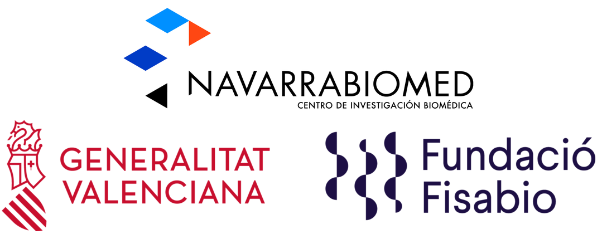

# Introducción

*****

En este proyecto se va a realizar la metodología del *Target trial*. Dicha metodología consiste en realizar la emulación de un ensayo clínico a través de datos observacionales. En particular se aplica la metodología descrita en Danaei 2013 [1]. Empleando esta metodología, se van a emular múltiples ensayos con diferentes tiempos índice. Para cada tiempo índice se aplicaran los criterios de inclusión/exclusión del ensayo clínico a emular. Por lo tanto, vamos a tener individuos que pueden participar en más de un ensayo. En concreto, los no-iniciadores durante todo el periodo, y, los iniciadores, en el periodo previo a la iniciación, van a participar en más de una emulación del ensayo clínico siempre y cuando cumplan el resto de criterios de inclusión/exclusión.

El caso de estudio que se va a analizar es el de la efectivad vacunal de la tercera dosis (segunda para los pacientes de Janssen) en la población general de la comunidad foral de Navarra. En el conjunto de la población española, la efectividad estimada entre los días 7 hasta el 34 después de la tercera dosis, con fechas de vacunación comprendidas entre el 3 de enero y el 6 de febrero de 2022, fue del 51.3% (95% CI 50.2–52.4) [2]. 
 

# Referencias

***

- [1] Danaei G, Rodríguez LAG, Cantero OF, Logan R, Hernán MA. Observational data for comparative effectiveness research: an emulation of randomised trials to estimate the effect of statins on primary prevention of coronary heart disease. Statistical methods in medical research 2013; 22: 70.

- [2] Monge S, Rojas-Benedicto A, Olmedo C, et al. Effectiveness of mRNA vaccine boosters against infection with the SARS-CoV-2 omicron (B.1.1.529) variant in Spain: a nationwide cohort study. The Lancet Infectious Diseases 2022; published online June. DOI:10.1016/S1473-3099(22)00292-4.
